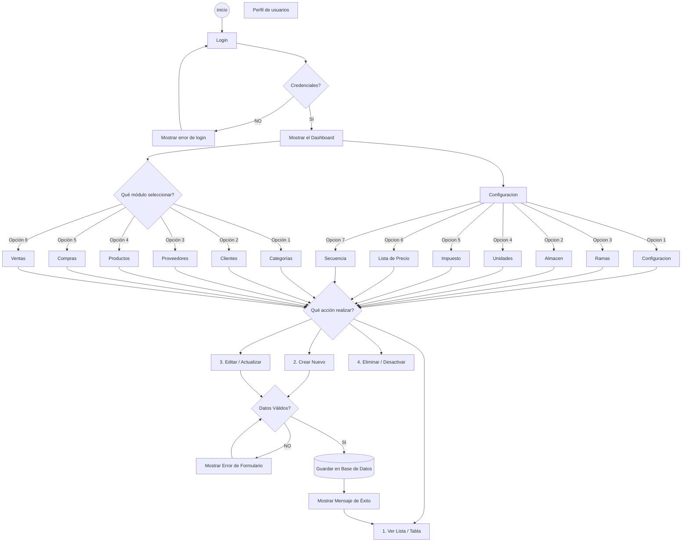

# Diagrama del sistema

```mermaid
flowchart TB
%% Identificadores base
    inicio((inicio))
    login[Login]
    credential{Credenciales?}
    noCredential[Mostrar error de login]
    dashboard[Mostrar el Dashboard]
    menu{Qué módulo seleccionar?}
    
%%    Datos de configuracion
    modProfile[Perfil de usuarios]
    modSetting[Configuracion]
    
    
    
%%   Ventas de configuracion
    setting[Configuracion]
    warehouse[Almacen]
    branch[Ramas]
    units[Unidades]
    tax[Impuesto]
    priceList[Lista de Precio]
    sequence[Secuencia]
    
    
%%    uniones
    dashboard-->modSetting
    modSetting--Opcion 1-->setting-->action
    modSetting--Opcion 3-->branch-->action
    modSetting--Opcion 2-->warehouse-->action
    modSetting--Opcion 4-->units-->action
    modSetting--Opcion 5-->tax-->action
    modSetting--Opcion 6-->priceList-->action
    modSetting--Opcion 7-->sequence-->action
    
    
    %% Módulos Principales
    modCategories[Categorías]
    modClients[Clientes]
    modProviders[Proveedores]
    modProducts[Productos]
    modPurchase[Compras]
    modSales[Ventas]
    
    %% Selector de Acción Genérico (Aplica a todos los módulos)
    action{Qué acción realizar?}
    showList[1. Ver Lista / Tabla]
    createRecord[2. Crear Nuevo]
    updateRecord[3. Editar / Actualizar]
    deleteRecord[4. Eliminar / Desactivar]
    
    %% Proceso de Validación y Base de Datos (Reutilizable)
    dataValid{Datos Válidos?}
    showError[Mostrar Error de Formulario]
    saveDB[(Guardar en Base de Datos)]
    showSuccess[Mostrar Mensaje de Éxito]
    
    %% Uniones de Autenticación
    inicio --> login
    login --> credential
    credential -- NO --> noCredential
    noCredential --> login
    credential -- SI --> dashboard
    dashboard --> menu
    
    
    
%%    MEnsaje de configuracion
    
    %% Uniones del Menú Principal
    menu -- Opción 1 --> modCategories
    menu -- Opción 2 --> modClients
    menu -- Opción 3 --> modProviders
    menu -- Opción 4 --> modProducts
    menu -- Opción 5 --> modPurchase
    menu -- Opción 6 --> modSales
    
    %% Enlace de los módulos al flujo unificado
    modCategories --> action
    modClients --> action
    modProviders --> action
    modProducts --> action
    modPurchase --> action
    modSales --> action
    
    %% Flujo de las Acciones
    action --> showList
    action --> createRecord
    action --> updateRecord
    action --> deleteRecord
    
    %% Proceso de Guardado y Validación (Crear y Editar)
    createRecord --> dataValid
    updateRecord --> dataValid
    
    dataValid -- NO --> showError
    showError --> dataValid
    
    dataValid -- SI --> saveDB
    saveDB --> showSuccess
    showSuccess --> showList

```

